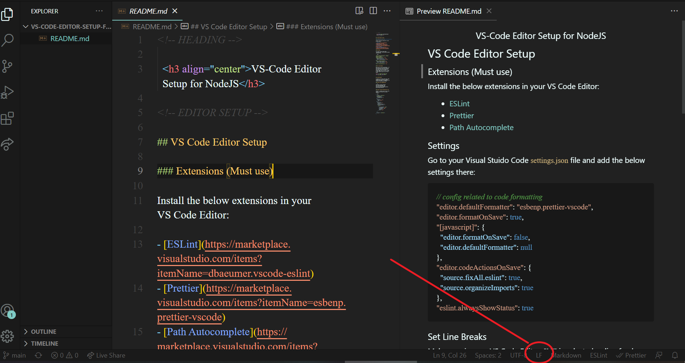

<!-- HEADING -->

  <h3 align="center">VS-Code Editor Setup for NodeJS</h3>

<!-- EDITOR SETUP -->

## VS Code Editor Setup

### Extensions (Must use)

Install the below extensions in your VS Code Editor:

- [ESLint](https://marketplace.visualstudio.com/items?itemName=dbaeumer.vscode-eslint)
- [Prettier](https://marketplace.visualstudio.com/items?itemName=esbenp.prettier-vscode)
- [Path Autocomplete](https://marketplace.visualstudio.com/items?itemName=ionutvmi.path-autocomplete)

### Settings

Go to your Visual Stuido Code `settings.json` file and add the below settings there:

```json
// config related to code formatting
"editor.defaultFormatter": "esbenp.prettier-vscode",
"editor.formatOnSave": true,
"[javascript]": {
  "editor.formatOnSave": false,
  "editor.defaultFormatter": null
},
"editor.codeActionsOnSave": {
  "source.fixAll.eslint": true,
  "source.organizeImports": true
},
"eslint.alwaysShowStatus": true
```

### Set Line Breaks

Make sure in your VS Code Editor, "LF" is selected as line feed instead of CRLF (Carriage return and line feed). To do that, just click LF/CRLF in bottom right corner of editor, click it and change it to "LF".



<!-- LINTING SETUP -->

## Linting Setup

In order to lint and format your code automatically according to popular airbnb style guide, I recommend you to follow the instructions bellow.

### Install Dev Dependencies

```sh
yarn add -D eslint prettier
npx install-peerdeps --dev eslint-config-airbnb-base
yarn add -D eslint-config-prettier eslint-plugin-prettier
```

### Setup Linting Configuration file

Create a `.eslintrc.json` file in the project root and enter the below contents:

```json
{
  "extends": ["prettier", "airbnb-base"],
  "parserOptions": {
    "ecmaVersion": 12
  },
  "env": {
    "commonjs": true,
    "node": true
  },
  "rules": {
    "no-console": 0,
    "indent": 0,
    "linebreak-style": 0,
    "prettier/prettier": [
      "error",
      {
        "trailingComma": "es5",
        "singleQuote": true,
        "printWidth": 100,
        "tabWidth": 4,
        "semi": true
      }
    ]
  },
  "plugins": ["prettier"]
}
```
